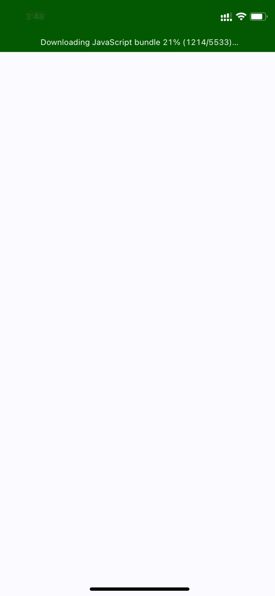

# Launch List APP

### To run project
> npm install && npm run pod && npm run ios

Result:

## States 
### When error happens

### When launch list is empty

### When everything fine
- Also you could see that you have `online` & `offline` status, it was done via websockets
  
